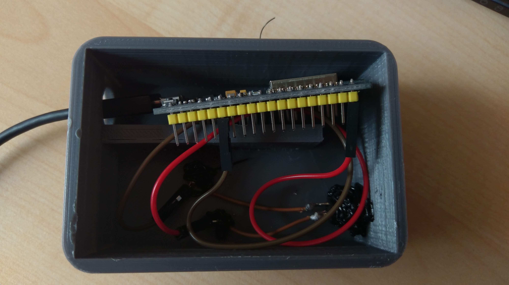

# Homemade Bell
#### Simple Arduino/ESP project
## Prestory
I wanted to create something simple using an ESP with WIFI. 
So I decided to create a small bell button which gives you a push notification.
## How to use
### The bell.php in server/ has to be modified:
 - Replace the (second) "key" in the if with an custom key.
 
Afterwards create a bell.txt writable by your webserver and upload it to your webserver.
Please keep in mind that 
1. everyone can read your last timestamp in the bell.txt  
2. Only the last timestamp will be logged
3. You need php installed to get this to work
4. The bell.txt should be publicly readable
### The bell.ino in bell/ has to be modified:
 - WIFI SSID has to be replaced with your SSID
 - WIFI PASSWORD with you password
 - http://bell.php with the path to your bell.php file
 - and the key (the value not the name) has to be replaced with your custom key
 
 Afterwards it can be flash onto an ESP with Wifi Support
 
 In order to use the bell you have to connect Pin 0 to Ground
 e.g. 
 
### The index.js in client/ has to be modified:
Change the value of the constant URL to the URL to your bell.txt

run `npm install `
and `npm start`
(you need to have npm installed)
### Some simple 3D Files for a simple box are in box/
These are custom for my circumstances. I can not recommend them for everyone
## License stuff
This is only for me learning doing stuff with electronic so:

1. Everything is licensed under MIT License
2. ##### EVERYTHING COMES WITHOUT ANY WARRANTY AND YOU ARE COMPLETELY RESPONSIBLE FOR DOING ANYTHING TOLD HERE.
